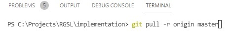

# Git instruction for newcomers

## Branch workflow instructions

1. Just you have started working on the task or bug, first you need to create a branch from the master branch.

2. In case your work on branch is continuing for several days it's good to align it with master by rebasing it.

Once you have resolved all merge conflicts you need to push all changes to your branch. The best way to do it is following:

3. Once you have finished the work you MUST do following steps:
   - check all your changes;
   - commit and push all changes;
   - locally rebase with master (check point 2 above);
   - create a merge request on the GitLab;

## Masks

Masks for branch and commit messages are following:

feature/[JIRA-TASK]-[description with kebab notation]

bugfix/[JIRA-TASK]-[description with kebab notation]

## Commands

**commit&push**: git add -A; git commit -a -m "[JIRA-TASK]: [description]"; git push;

**rebase**:
     - git pull -r origin master
     - resolve conflicts on rebase: after manual resolvation all conflicted files *MUST be staged* !!! After that execute git rebase --continue
     - git push --force-with-lease
