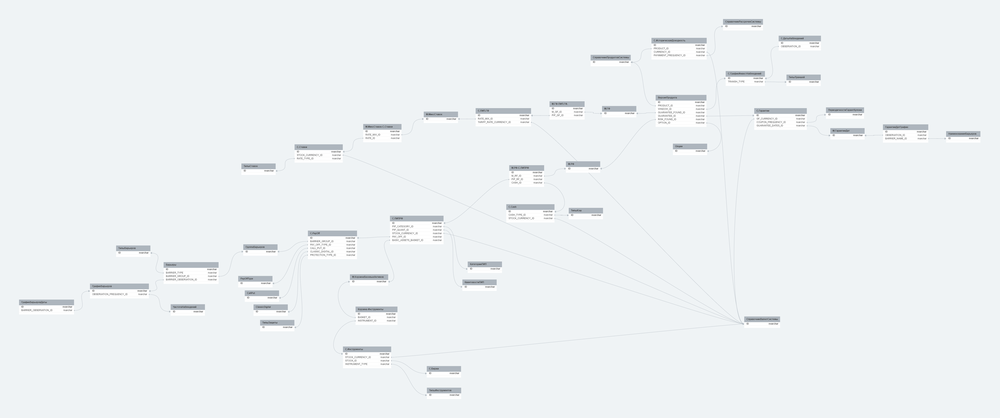

# Cтруктура настроек ИСЖ в БД

## Исходные данные

Эпик в JIRA: [ADIRGSLSUPP-14](https://jira.adacta-fintech.com/browse/ADIRGSLSUPP-14)

## По результатам анализа

Специфические настройки ДСЖ:
[Ссылка](https://erd.dbdesigner.net/designer/schema/1689780364-dp_ul)

Общие продуктовые настройки:
[Ссылка](https://erd.dbdesigner.net/designer/schema/1692340884-dp_productconf)

## TBD

- описание названий таблиц и полей в соответствии с ТЗ;
- описание использования скриптов executeScripts.ps1 и concat.ps1;
